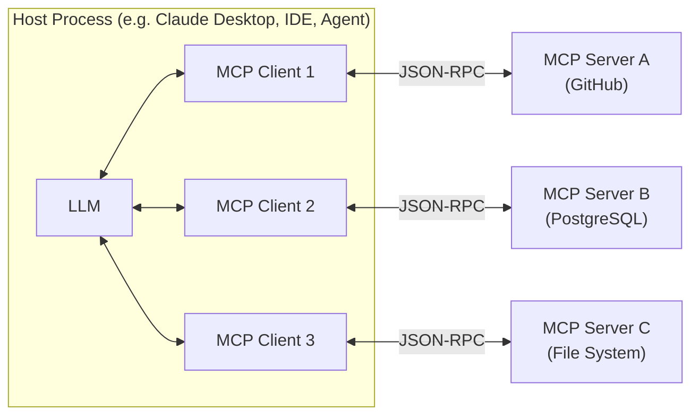

# Model Context Protocol (MCP)

Last reviewed: 2026-02-10

[Contents](README.md) | [Prev](04-agents.md) | [Next](05-evals.md)

## Summary

The [Model Context Protocol (MCP)](https://modelcontextprotocol.io/specification/2025-11-25) is an open standard for connecting LLM-powered applications to external tools, data sources, and services through a single, consistent interface. Before MCP, every integration between an AI application and an external system required a bespoke connector (custom-built glue code), creating an N-times-M problem: N applications times M integrations, each built and maintained separately. MCP collapses this to N-plus-M by defining a universal protocol that any client can use to talk to any server. For teams building agent systems that need to interact with databases, APIs, file systems, or third-party services, MCP is the emerging standard for how that wiring works.

## See Also
- [Structured Outputs And Tool Calling](11-structured-outputs-and-tool-calling.md) — how LLMs invoke tools in general; MCP standardizes the discovery and transport layer for those tools.
- [Agents](04-agents.md) — MCP servers are the primary way agents discover and interact with external capabilities.
- [Safety, Privacy, And Security](06-safety-privacy-security.md) — MCP introduces new trust boundaries that need careful attention.
- [Architecture Recipes](07-architecture-recipes.md) — concrete patterns where MCP fits as a system component.

## The Problem MCP Solves

Consider a typical AI engineering team. They build a coding assistant that needs access to GitHub, a documentation Q&A system that needs access to Confluence, and an internal agent that queries a PostgreSQL database. Without a standard protocol, each of these integrations requires custom code: different authentication flows, different data formats, different error handling, different ways to describe available capabilities to the model.

This is the same problem the software industry has solved repeatedly in other domains. The [Language Server Protocol (LSP)](https://microsoft.github.io/language-server-protocol/) solved it for editor-to-language-tooling communication. USB solved it for hardware peripherals. [OAuth](https://oauth.net/) solved it for delegated authorization. MCP solves it for LLM-to-tool communication.

The core value proposition is straightforward: build a tool integration once as an MCP server, and any MCP-compatible client can use it. Switch your AI model provider, and your tools keep working. Add a new tool, and every client in your system can discover and use it without code changes.

## Architecture

MCP defines three roles that collaborate in every interaction: the host, the client, and the server.



**Host.** The host is the application the user interacts with: Claude Desktop, an IDE with an AI plugin, a custom agent framework, or ChatGPT. The host is responsible for managing the lifecycle of MCP clients, enforcing security policies, and coordinating the LLM's access to the capabilities that clients expose.

**Client.** The host spawns one MCP client per server connection. Each client maintains a one-to-one relationship with a single server, handling protocol negotiation, message routing, and connection isolation. This one-to-one mapping is a deliberate design choice: it prevents one misbehaving server from affecting another.

**Server.** An MCP server is a standalone process that exposes capabilities (tools, resources, prompts) through the protocol. A server typically wraps a single integration: a GitHub server exposes repository operations, a PostgreSQL server exposes query capabilities, a file system server exposes read/write operations. Servers can be local processes or remote services.

The separation of host, client, and server creates clean trust boundaries. The host controls what the LLM can access. The client isolates each server connection. The server controls what capabilities it exposes and how it validates requests.

## Transport Mechanisms

MCP is transport-agnostic. The protocol operates over [JSON-RPC 2.0](https://www.jsonrpc.org/specification) and can run over any channel that carries bidirectional JSON text. In practice, two transport mechanisms dominate.

### stdio (Standard Input/Output)

The client launches the server as a subprocess and communicates through stdin/stdout. Messages are newline-delimited JSON-RPC. The client manages the server process lifecycle: start, stop, and signal handling (SIGTERM, then SIGKILL if the server does not exit gracefully).

stdio is the right choice for local integrations: file system access, local database connections, development tools. It is simple to implement, requires no network configuration, and the client has direct control over the server process. The tradeoff is that it only works when client and server run on the same machine.

One important implementation detail: servers using stdio must never write non-protocol content to stdout, because it will corrupt the JSON-RPC stream. Diagnostic logging must go to stderr or to a file.

### Streamable HTTP

For remote servers, MCP uses HTTP with optional Server-Sent Events (SSE) for streaming. The client sends JSON-RPC messages as HTTP POST requests to a single endpoint. The server can respond with a single JSON response (`Content-Type: application/json`) or open an SSE stream (`Content-Type: text/event-stream`) for multiple messages. This replaced the earlier HTTP+SSE transport in the [June 2025 spec revision](https://modelcontextprotocol.io/specification/2025-11-25/changelog), though the legacy transport remains supported for backward compatibility.

Streamable HTTP is the right choice for remote integrations: cloud APIs, shared infrastructure, multi-tenant services. It supports standard HTTP features like load balancing, TLS, and authentication headers.

## Core Primitives

MCP defines three server-side primitives, each with a different control model. Understanding who controls each primitive is essential for building correct systems.

### Tools (Model-Controlled)

Tools are executable functions that the LLM can invoke. A tool might query a database, call an API, create a file, or perform a calculation. The server declares available tools with their names, descriptions, and input schemas ([JSON Schema](https://json-schema.org/)). The LLM decides when and how to call them based on the user's request and the tool descriptions.

The client discovers tools by sending a `tools/list` request and invokes them with `tools/call`. As of the [June 2025 spec](https://modelcontextprotocol.io/specification/2025-11-25/changelog), tools can declare an `outputSchema` for structured, typed responses that clients can validate programmatically.

Tools are the most commonly used primitive. If you are building an MCP server, you are almost certainly exposing tools.

### Resources (Application-Controlled)

Resources are data that the server makes available for the client application to read. Each resource is identified by a URI (`file:///path/to/doc.md`, `postgres://db/table`, `https://api.example.com/data`). Resources can contain text or binary data.

The key distinction from tools is the control model: the host application decides when to fetch resources, not the LLM. Resources are designed for context-loading scenarios: pulling in documentation, configuration files, or reference data that the LLM needs to do its job. The server can notify the client when resources change, and clients can subscribe to updates for specific resources.

### Prompts (User-Controlled)

Prompts are server-defined templates for structured interactions with the LLM. A server might expose a "summarize-pull-request" prompt or a "review-code" prompt, each with defined parameters and a specific message structure.

Prompts are user-controlled: they are designed to be explicitly selected by the user through the client's interface, not automatically invoked by the model. This makes them useful for standardizing common workflows across teams. A team can publish prompt templates through an MCP server and ensure that everyone uses the same structure for code reviews, data analysis, or incident triage.

### Client-Side Primitives

MCP also defines capabilities that servers can request from clients. **Sampling** allows a server to ask the client to run an LLM inference and return the result, enabling server-side agent loops without the server needing its own model connection. **Roots** let the server understand which directories or URIs the client has made available. **Elicitation** enables the server to request information from the user through the client, supporting multi-turn human-in-the-loop interactions.

## Protocol Lifecycle

Every MCP connection follows a three-phase lifecycle: initialize, operate, shut down.

### Initialization

The connection begins with a three-step handshake:

1. The client sends an `initialize` request containing its protocol version and declared capabilities.
2. The server responds with its own protocol version and capabilities.
3. The client sends an `initialized` notification to confirm.

This handshake serves two purposes. First, it ensures both sides agree on the protocol version. Second, it establishes what each side can do: if the server does not declare tool support, the client will not send tool requests. This capability negotiation keeps the protocol extensible without breaking backward compatibility.

### Operation

After initialization, both sides exchange messages based on their negotiated capabilities. The client can list and invoke tools, read resources, and retrieve prompts. The server can send notifications (resource changes, tool list updates) and, if the client declared sampling support, request LLM inferences.

MCP is a stateful protocol. The connection persists across multiple request-response cycles, which enables servers to maintain context, cache state, and push notifications.

### Shutdown

For stdio transports, the client closes the server's stdin and waits for the process to exit, escalating to SIGTERM and then SIGKILL if necessary. For HTTP transports, the client simply closes the HTTP connection. No special shutdown message is defined at the protocol level.

## Security Model And Trust Boundaries

MCP introduces new trust boundaries into your system, and getting the security model wrong can have serious consequences. An MCP server that can execute shell commands or send emails is an attack surface, not just a convenience.

### Authorization

MCP defines an [OAuth 2.1](https://oauth.net/2.1/)-based authorization framework for remote servers. The server acts as an OAuth resource server, the client acts as an OAuth client, and a separate authorization server issues tokens. As of the June 2025 spec, clients must implement [Resource Indicators (RFC 8707)](https://datatracker.ietf.org/doc/html/rfc8707) to ensure that tokens are scoped to specific servers, preventing a malicious server from using a token intended for another service.

The November 2025 spec added enterprise-managed authorization, allowing organizations to enforce centralized policies about which clients can access which servers, using existing identity providers. This addresses the "shadow IT" problem where individual developers connect AI tools to corporate systems without organizational oversight.

### Key Security Principles

**User consent is mandatory.** Hosts must obtain explicit user approval before exposing data to servers or executing tools. The user should understand what a server can access and what actions it can take before the connection is established.

**Servers should not trust clients blindly, and clients should not trust servers blindly.** The protocol enforces isolation between server connections (one client per server), but each side must still validate inputs and outputs.

**Servers running locally should bind only to localhost** (127.0.0.1), not to all network interfaces. Servers must validate the `Origin` header on incoming connections to prevent DNS rebinding attacks.

**Sandbox server processes.** The official security guidance recommends running MCP servers in containers or virtual machines with read-only file systems, constrained network access, and no inherited host credentials.

### Real-World Threats

The threat model for MCP servers is not theoretical. In September 2025, an unofficial [Postmark](https://postmarkapp.com/) MCP server was found to contain a backdoor that silently added a BCC recipient to all outgoing emails. The incident demonstrated that community MCP servers --- which run with the permissions of the host process and whose tool descriptions are injected into the LLM's context --- are a supply-chain attack surface. Whether the vector is malicious code in the server implementation or adversarial instructions hidden in tool descriptions, the result is the same: the user's AI assistant takes actions the user did not intend.

Prompt injection through tool descriptions, resource content, or server responses is a first-class concern. An MCP server that returns untrusted content (web pages, user-generated data, third-party API responses) can inject instructions into the LLM's context. All the defenses described in the Safety, Privacy, and Security chapter apply here, with the additional wrinkle that the attack surface scales with the number of connected servers.

## When To Use MCP vs. Direct Tool Calling

MCP and direct tool calling (where tool definitions are embedded in the LLM API request) are complementary, not competing approaches. The decision depends on your system's scale, reusability needs, and operational model.

**Use direct tool calling when** you have a small number of tools that are tightly coupled to a single application. If you are building a chatbot with three custom functions that will never be reused, the overhead of running a separate MCP server process is not justified. Tool definitions live alongside your prompt, the code is easy to follow, and there is no separate infrastructure to manage.

**Use MCP when** you need tool integrations that are shared across multiple applications or models, when you want dynamic tool discovery at runtime, when you are building an agent that needs to interact with many external systems, or when you want to decouple tool implementation from your AI application. MCP's value scales with the number of integrations and the number of consumers. A single MCP server for your company's PostgreSQL databases can serve every AI application in the organization.

**Use both together** when it makes sense. A common pattern is to expose a generic `call_mcp_tool` function through your model's native tool-calling interface, which routes to MCP servers under the hood. This gives you the model's native tool-calling experience with MCP's standardized server ecosystem.

One practical consideration: every connected MCP server adds tool descriptions to the LLM's context, consuming tokens. With many servers, the combined tool definitions can become a significant fraction of your context window. Anthropic has [documented an approach](https://www.anthropic.com/engineering/code-execution-with-mcp) where MCP servers are presented as code APIs rather than direct tool calls, reducing token overhead.

## Provider Support

As of 2026-02-10, MCP has broad support across major AI platforms:

**Anthropic Claude.** MCP [originated at Anthropic](https://www.anthropic.com/news/model-context-protocol). [Claude Desktop](https://claude.ai/download), the Claude API, and the Anthropic SDKs have first-class MCP support. Claude Desktop can connect to local MCP servers via stdio out of the box.

**OpenAI ChatGPT.** [OpenAI adopted MCP](https://openai.com/index/agentic-ai-foundation/) in March 2025. ChatGPT supports MCP connectors (renamed to "apps" in December 2025) via Streamable HTTP with optional OAuth authentication. The [OpenAI Agents SDK](https://github.com/openai/openai-agents-python) includes native MCP client support in both Python and TypeScript.

**Google Gemini.** Google [announced managed MCP servers](https://cloud.google.com/blog/products/ai-machine-learning/announcing-official-mcp-support-for-google-services) for Google services including Maps, BigQuery, Compute Engine, and Kubernetes Engine. The [Gemini CLI](https://github.com/google-gemini/gemini-cli) and Google's [Agent Development Kit (ADK)](https://github.com/google/adk-python) support MCP natively.

**Microsoft Copilot.** MCP is [generally available in Microsoft Copilot Studio](https://www.microsoft.com/en-us/microsoft-copilot/blog/copilot-studio/model-context-protocol-mcp-is-now-generally-available-in-microsoft-copilot-studio/), allowing agents built in Copilot Studio to connect to MCP servers. [Visual Studio Code](https://code.visualstudio.com/) also supports MCP for AI-assisted development features.

**Developer tools.** [Cursor](https://www.cursor.com/), [Windsurf](https://windsurf.com/), and other AI-powered IDEs support MCP for extending their capabilities with custom tools and data sources.

This level of cross-vendor adoption is unusual for a protocol that is only about a year old. For comparison, protocols like [OpenAPI](https://www.openapis.org/) and [OAuth 2.0](https://oauth.net/2/) took significantly longer to reach comparable industry support.

## Building an MCP Server

Building an MCP server is conceptually similar to building a web API. You define capabilities (tools, resources, prompts), handle requests, and return responses. The official SDKs handle the protocol plumbing.

### Conceptual Structure

An MCP server has three layers:

1. **Transport layer.** Handles JSON-RPC message framing over stdio or HTTP. The SDK provides this out of the box.
2. **Protocol layer.** Handles initialization, capability negotiation, and message routing. The SDK provides this too.
3. **Capability layer.** Your code. This is where you define what tools your server exposes, what they do, and what resources are available.

### A Minimal Server in Python

The [official Python SDK](https://github.com/modelcontextprotocol/python-sdk) uses a `FastMCP` class that leverages type hints and docstrings to generate tool definitions automatically:

```python
from mcp.server.fastmcp import FastMCP

mcp = FastMCP("my-server")

@mcp.tool()
def lookup_user(user_id: str) -> str:
    """Look up a user by their ID and return their profile information."""
    # Your implementation here: query a database, call an API, etc.
    return f"User {user_id}: name=Alice, role=engineer"

@mcp.resource("config://app-settings")
def get_settings() -> str:
    """Return the current application configuration."""
    return '{"theme": "dark", "language": "en"}'
```

The `@mcp.tool()` decorator registers a function as an MCP tool. The function's type hints become the tool's input schema, and the docstring becomes the tool's description, which is what the LLM reads to decide when to call it. This is important: the quality of your docstrings directly affects how well models use your tools.

### A Minimal Server in TypeScript

The [TypeScript SDK](https://github.com/modelcontextprotocol/typescript-sdk) uses [Zod](https://zod.dev/) for schema validation:

```typescript
import { McpServer } from "@modelcontextprotocol/sdk/server/mcp.js";
import { z } from "zod";

const server = new McpServer({ name: "my-server", version: "1.0.0" });

server.tool(
  "lookup_user",
  "Look up a user by their ID and return their profile information.",
  { user_id: z.string() },
  async ({ user_id }) => ({
    content: [{ type: "text", text: `User ${user_id}: name=Alice` }]
  })
);
```

### Key Design Decisions

**Keep servers focused.** Each server should wrap a single integration or a tightly related set of capabilities. A "GitHub server" that handles repositories, issues, and pull requests is coherent. A "Swiss army knife server" that handles GitHub, Slack, and PostgreSQL is not.

**Write good tool descriptions.** The LLM selects tools based on their descriptions, not their implementations. A vague description leads to misuse; a precise one leads to correct invocations. Include parameter constraints, expected behavior, and side effects in the description.

**Handle errors explicitly.** Return structured error information that helps the LLM decide what to do next. "Query failed: table 'users' does not exist" is actionable. "Internal server error" is not.

**Test with multiple clients.** An MCP server should work with Claude Desktop, with a custom agent, and with any other MCP client. If your server only works with one client, you have a compatibility bug, not an MCP server.

## Community Ecosystem

### The MCP Registry

As of 2025-09-08, there is an official [MCP Registry](https://registry.modelcontextprotocol.io/) at `registry.modelcontextprotocol.io`. The registry is a centralized metadata repository for publicly accessible MCP servers. It uses namespace authentication (reverse DNS format, tied to verified GitHub accounts or domains) to ensure that servers come from their claimed sources.

The registry is designed primarily for programmatic consumption by subregistries (downstream marketplaces like Smithery, PulseMCP, Docker Hub) rather than direct end-user consumption. Subregistries like [Smithery](https://smithery.ai/), [PulseMCP](https://www.pulsemcp.com/), and [Docker Hub](https://hub.docker.com/) add curation, ratings, security scanning, and enterprise features.

### Official Reference Servers

The [`modelcontextprotocol/servers`](https://github.com/modelcontextprotocol/servers) GitHub repository contains reference implementations maintained by the MCP steering group. These are educational examples demonstrating SDK usage and MCP features, not production-ready solutions. They cover integrations with file systems, Git, GitHub, PostgreSQL, Slack, Google Drive, and others.

### SDKs

Official SDKs exist for [Python](https://github.com/modelcontextprotocol/python-sdk), [TypeScript](https://github.com/modelcontextprotocol/typescript-sdk), [C#](https://github.com/modelcontextprotocol/csharp-sdk), and [Java](https://github.com/modelcontextprotocol/java-sdk). The Python and TypeScript SDKs are the most mature, with 97 million combined monthly downloads as of November 2025. Third-party SDKs and higher-level frameworks (like the standalone [FastMCP](https://github.com/jlowin/fastmcp) project for Python, which powers an estimated 70% of MCP servers) extend the ecosystem further.

## Governance

As of 2025-12-09, [Anthropic donated MCP](https://www.anthropic.com/news/donating-the-model-context-protocol-and-establishing-of-the-agentic-ai-foundation) to the [Agentic AI Foundation (AAIF)](https://www.linuxfoundation.org/press/linux-foundation-announces-the-formation-of-the-agentic-ai-foundation), a directed fund under the [Linux Foundation](https://www.linuxfoundation.org/). The AAIF was co-founded by Anthropic, Block, and OpenAI, with platinum members including AWS, Google, Microsoft, Bloomberg, and Cloudflare. The foundation's governing board handles strategic decisions, while MCP's existing maintainers retain full autonomy over the protocol's technical direction. Other founding projects of the AAIF include [goose](https://github.com/block/goose) (Block's open-source agent framework) and [AGENTS.md](https://github.com/openai/agents-md) (OpenAI's standard for repository-level agent guidance).

## Specification Versions

MCP has gone through three specification releases:

- **[2024-11-05](https://modelcontextprotocol.io/specification/2024-11-05) (initial release).** The first public specification, establishing the core architecture, primitives, and transport mechanisms.
- **[2025-06-18](https://modelcontextprotocol.io/specification/2025-06-18).** Added structured tool outputs (`outputSchema`), elicitation for server-initiated user interactions, [OAuth 2.1](https://oauth.net/2.1/) authorization with [Resource Indicators (RFC 8707)](https://datatracker.ietf.org/doc/html/rfc8707), and Streamable HTTP transport replacing legacy HTTP+SSE.
- **[2025-11-25](https://modelcontextprotocol.io/specification/2025-11-25).** Added the Tasks primitive for asynchronous operations (call-now, fetch-later), sampling with tool support for server-side agent loops, URL-mode elicitation for secure credential collection in browsers, standardized OAuth scope names, and a formal extension mechanism.

The protocol continues to evolve. Areas under active development include server discoverability through `.well-known` URLs, official domain-specific extensions, and further async operation support.

## Pitfalls

**Treating MCP as a replacement for direct tool calling.** MCP adds a process boundary and a protocol layer. For simple applications with a few static tools, this overhead is not justified. Use MCP when you need the benefits it provides (reusability, dynamic discovery, multi-client support) and direct tool calling when you do not.

**Connecting too many servers at once.** Every server's tool descriptions consume context tokens. With ten servers exposing five tools each, you have fifty tool descriptions competing for the LLM's attention and context window. Start with the servers you actually need, and consider code-API patterns for large server counts.

**Trusting community servers without review.** MCP servers run code on your machine or have access to your credentials. A malicious or compromised server can exfiltrate data, inject prompts, or perform unwanted actions. Audit servers before deploying them, pin versions, and monitor their behavior. The September 2025 [Postmark incident](https://www.redhat.com/en/blog/model-context-protocol-mcp-understanding-security-risks-and-controls) demonstrated that even popular community servers can be compromised.

**Ignoring transport security for remote servers.** Remote MCP servers communicate over HTTP. If you are not using TLS, authentication, and proper token scoping, you are exposing tool invocations and their results to network attackers. The protocol's [OAuth 2.1](https://oauth.net/2.1/) support exists for a reason.

**Assuming the protocol is stable.** MCP is evolving rapidly. The spec has had three revisions in its first year, with breaking changes between versions. Pin your SDK versions, track the changelog, and budget time for protocol upgrades.

**Poor tool descriptions.** The LLM selects tools based on their descriptions. If your tool description is vague ("Does stuff with users"), the model will misuse it. If it is misleading, the model will call it in wrong contexts. Treat tool descriptions as part of your prompt engineering surface.

**Skipping local server sandboxing.** A local MCP server launched via stdio runs with the permissions of the host process by default. If that server has a vulnerability, the attacker inherits those permissions. Run local servers with minimal privileges, in containers where possible, and never pass host credentials through environment variables.

## Checklist

- Have you identified which integrations benefit from MCP (shared, multi-client) vs. direct tool calling (single-use, simple)?
- Does each MCP server expose a focused, coherent set of capabilities rather than a grab-bag of unrelated tools?
- Are tool descriptions precise enough for the LLM to use them correctly, including parameter constraints and side effects?
- Do you validate tool inputs on the server side, not just rely on schema validation?
- For remote servers, is OAuth 2.1 authorization configured with proper token scoping (Resource Indicators)?
- For local servers, are processes sandboxed with minimal privileges?
- Have you audited any community MCP servers you depend on, pinned their versions, and set up monitoring?
- Is your total tool count across all connected servers manageable within your context window budget?
- Do you have a plan for tracking MCP spec changes and upgrading SDKs?
- Have you tested your servers with multiple MCP clients to verify protocol compliance?

## References

- MCP Specification (2025-11-25). https://modelcontextprotocol.io/specification/2025-11-25
- Introducing the Model Context Protocol (Anthropic announcement, November 2024). https://www.anthropic.com/news/model-context-protocol
- One Year of MCP: November 2025 Spec Release (official blog). https://blog.modelcontextprotocol.io/posts/2025-11-25-first-mcp-anniversary/
- MCP joins the Agentic AI Foundation (official blog, December 2025). https://blog.modelcontextprotocol.io/posts/2025-12-09-mcp-joins-agentic-ai-foundation/
- Donating the Model Context Protocol (Anthropic, December 2025). https://www.anthropic.com/news/donating-the-model-context-protocol-and-establishing-of-the-agentic-ai-foundation
- OpenAI adopts MCP (OpenAI, March 2025). https://openai.com/index/agentic-ai-foundation/
- Announcing official MCP support for Google services (Google Cloud Blog). https://cloud.google.com/blog/products/ai-machine-learning/announcing-official-mcp-support-for-google-services
- MCP in Copilot Studio (Microsoft, GA announcement). https://www.microsoft.com/en-us/microsoft-copilot/blog/copilot-studio/model-context-protocol-mcp-is-now-generally-available-in-microsoft-copilot-studio/
- MCP Specification changelog (June 2025). https://modelcontextprotocol.io/specification/2025-11-25/changelog
- Official MCP servers repository. https://github.com/modelcontextprotocol/servers
- Official MCP Registry. https://registry.modelcontextprotocol.io/
- MCP Python SDK. https://github.com/modelcontextprotocol/python-sdk
- MCP TypeScript SDK. https://github.com/modelcontextprotocol/typescript-sdk
- Linux Foundation Agentic AI Foundation announcement. https://www.linuxfoundation.org/press/linux-foundation-announces-the-formation-of-the-agentic-ai-foundation
- Understanding MCP security risks and controls (Red Hat). https://www.redhat.com/en/blog/model-context-protocol-mcp-understanding-security-risks-and-controls
- Code execution with MCP (Anthropic engineering blog). https://www.anthropic.com/engineering/code-execution-with-mcp

*Last audited: 2026-02-10 · [Audit methodology](23-audit-methodology.md)*

---
[Contents](README.md) | [Prev](04-agents.md) | [Next](05-evals.md)
